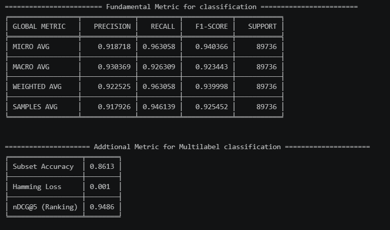
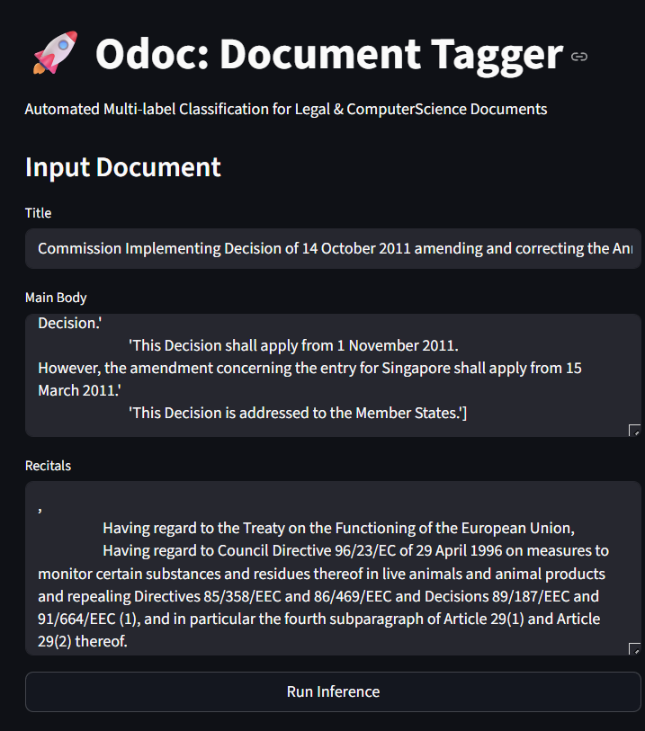
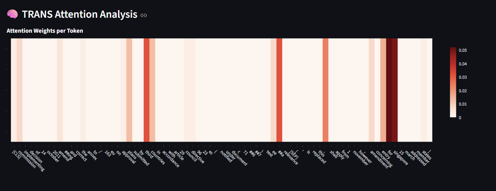

# Odoc Tagger — Extreme Multi-Label Text Classification with Label-Wise Attention

**Author:** Vũ Hoàng Tùng · HCMUT · 2026  
**Full Report:** [`reports/ass1_text.pdf`](../reports/ass1_text.pdf)  
**Live Demo:** [odoctagger-v1.streamlit.app](https://odoctagger-v1.streamlit.app)

---

## Overview

A document tagging engine that assigns the **correct labels out of 4,000+** to a single document — including labels **never seen during training** (zero-shot). Benchmarked on **EURLEX-57K** (EU legal corpus, 4,271 labels) and validated on **real student questions from public Stack Exchange**.

The core technique is **Label-Wise Attention (LWA)**: instead of compressing a document into one shared vector for every label, LWA learns a *separate* attention head per label so each tag attends to the exact tokens that justify it.

**Why LWA?**
- **Per-label focus** — each label has its own view of the document, not a shared bottleneck
- **Scales to extreme label spaces** — decouples encoder from label count, keeping inference tractable
- **Explainable by design** — attention weights reveal *why* a label was predicted
- **Zero-shot generalisation** — unseen labels still attend to semantically relevant tokens

---

## Key Achievements

| What | Result |
|---|---|
| Macro-F1 improvement (vanilla → ours) | 0.031 → **0.251** |
| Precision@1 with 33M-param backbone | **> 0.88** |
| Context window (tokens) | 512 → **1,024** (multi-segment fusion) |
| Hamming Loss | **0.00076** (BiLSTM) |

**Technical highlights:**

- **Multi-segment context** — `Title + Body` and `Recitals` fused to expand the effective context window from 512 to 1,024 tokens, enabling full comprehension of long legal documents.
- **Asymmetric Loss (ASL)** — suppresses the ~4,187 negative-label majority per document without discarding genuine rare-label signal.
- **Weight balancing** — compensates for labels with < 0.001% frequency (the extreme long tail).
- **Semantic Warm-start** — fine-tuning strategy that anchors the encoder's semantic compass from epoch 1, cutting early divergence.

---

## Benchmark — EURLEX-57K

| Model | Micro F1 | Macro F1 | P@1 | R@1 | nDCG@5 | Hamming |
|---|---|---|---|---|---|---|
| RoBERTa* (SOTA) | 0.685 | 0.220 | 0.922 | 0.210 | 0.823 | — |
| BIGRU-LWAN (L2V) | 0.612 | 0.185 | 0.913 | 0.198 | 0.804 | — |
| HAN | 0.584 | 0.142 | 0.894 | 0.182 | 0.778 | — |
| Vanilla MiniLM (baseline) | 0.051 | 0.031 | 0.170 | 0.035 | 0.105 | 0.00160 |
| **BiLSTM-ASLCB (ours)** | **0.645** | **0.247** | **0.889** | **0.203** | **0.755** | **0.00076** |
| **Trans-ASLCB (ours)** | **0.639** | **0.251** | **0.881** | **0.200** | **0.761** | 0.00085 |

*\*RoBERTa fine-tuned as LegalBERT. Our models use a 33M-parameter backbone at a fraction of the inference cost.*

---

## Real-World Validation — Stack Exchange Student Questions

To test generalisation beyond the training corpus, the model was evaluated against **real questions posted by students on public Stack Exchange** (89,736 label decisions):

| Metric | Score |
|---|---|
| Micro F1 | **0.9407** |
| Macro F1 | **0.9234** |
| Weighted F1 | **0.9400** |
| Subset Accuracy | **86.13%** |
| Hamming Loss | **0.001** |
| nDCG@5 (ranking) | **0.9486** |

> The model generalises strongly outside its training domain (legal text → CS/engineering Q&A), demonstrating that LWA's per-label attention captures transferable semantic signals rather than domain-specific surface patterns.

---

## Inference Interface

The live app accepts a document's **Title**, **Main Body**, and **Recitals** separately — mirroring the multi-segment fusion used during training.

- Input any long-form document across the three fields
- Click **Run Inference** to get ranked label predictions
- Attention Rollout visualisation loads alongside the tags

**Try it live:** [odoctagger-v1.streamlit.app](https://odoctagger-v1.streamlit.app)

---

## Explainability — Attention Rollout

Attention weights are propagated back through all Transformer layers via **Attention Rollout**, then mapped to input tokens. The heatmap below shows a real inference on an EU Commission decision:

**Reading the heatmap:** red = high attention weight, white = near-zero. The model correctly focuses on named entities (`Commission`, `Singapore`, `amendment`) while suppressing dates, article numbers, and function words — exactly the signals a human expert would use to tag the document.

---

*Part of the HCMUT Deep Learning Assignment 1 suite. See [`../gitpages/ass1/text.html`](../gitpages/ass1/text.html) for the full interactive report.*
